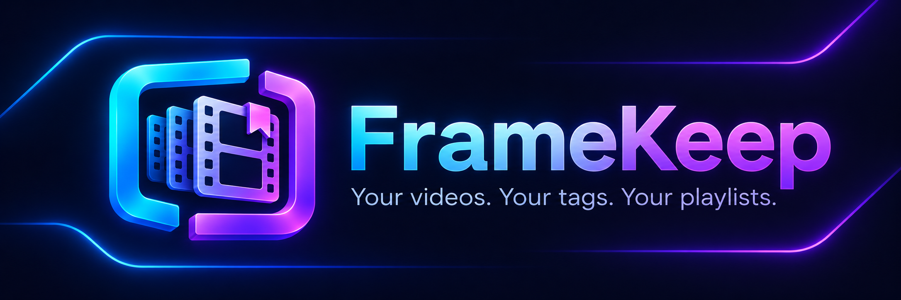
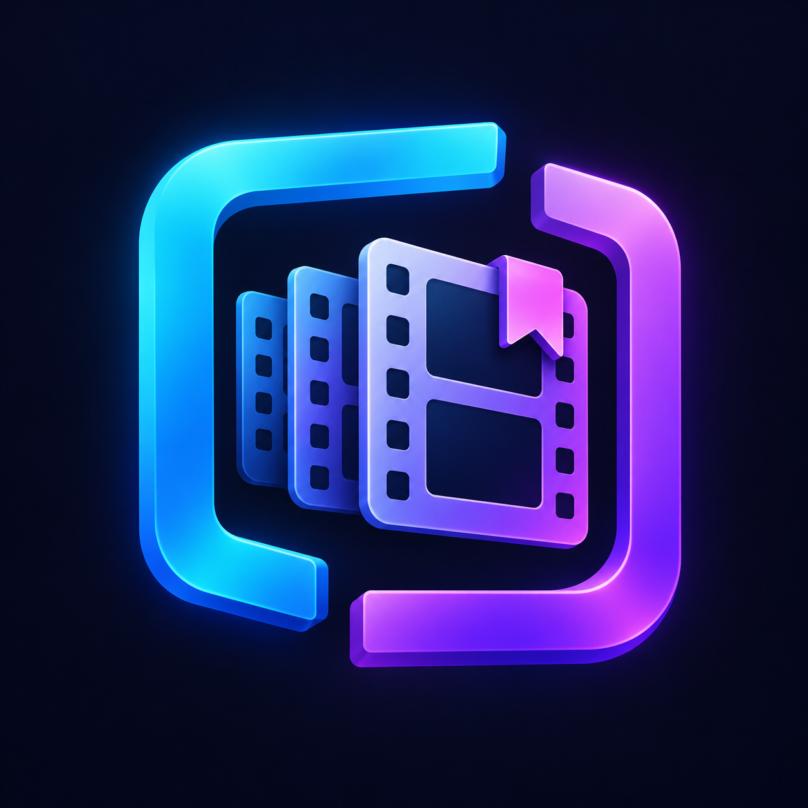

# FrameKeep · v0.3

A self-hosted, single-page video player and library for your own collection. Organize videos with tags and playlists instead of rearranging folders. File locations, display names, ratings, and playback progress live in SQLite; videos stay on disk where you put them.

## Features

- Multiple recursive library locations, with offline-drive protection.
- Editable display names, styled tags, bulk tagging, and include/exclude tag filters.
- Playlists, reordering, playlist sequences, shuffle, and repeat.
- Zero-to-five star ratings, duration and resolution filters, and file details.
- Square thumbnail previews with a configurable capture time.
- Adjustable page size, optional complete rows, page entry, and a page slider.
- Saved playback position, volume, mute state, and optional autoplay on opening.
- Configurable startup and periodic scans, with live activity messages.
- Moved-file recovery and possible-rename suggestions.
- Metadata backup and restore, with a recovery snapshot before restoration.
- Searchable in-app help and settings that save automatically.

## Pick up where you left off

Move from the kitchen to the living room and continue your video on another device. Open the **same FrameKeep server** and it restores the last saved video, playback position, volume, and mute state. Progress saves every ten seconds and when you pause or seek; closing the page also attempts a final save. Enable autoplay if you want playback to begin automatically, subject to your browser’s autoplay rules.

Your devices share the server’s library, tags, playlists, ratings, and global settings. The most recently opened browser session owns playback saves, so an older open tab cannot overwrite your newer session’s saved place. Filters and current page remain local to each browser; this is saved-state continuity rather than synchronized playback across screens.

## Requirements

- A PHP web server with PDO SQLite enabled. Development was tested with PHP 8.3 on Windows using Laragon.
- Write access to the application's data folder and read access to video locations.
- FFmpeg for thumbnails and FFprobe for duration/resolution inspection; PHP must permit `proc_open`.
- A browser supporting your video files' actual codecs. An MP4 extension alone does not guarantee playback compatibility.

## Quick start

1. Download or clone this repository.
2. Set your web server's **document root to the inner `FrameKeep` directory**, the folder containing `index.php`. The application expects to run at that document root.
3. Enable `pdo_sqlite` in the web server's PHP configuration.
4. Start the web server and open its local address. FrameKeep creates its data folder and database schema automatically.
5. Open **Settings → Libraries**, add a readable folder, and click **Rescan**. Scanning includes subfolders; folder names do not assign tags.
6. Configure FFmpeg and FFprobe below to enable generated previews and media details.

For a basic development preview, run this from the inner application folder:

```sh
php -S 127.0.0.1:8080 -t .
```

Open `http://127.0.0.1:8080/`. PHP's development server handles requests sequentially; scans and thumbnail generation can delay playback requests or activity updates. A regular web server is preferable for daily use.

## Private configuration

Shared application paths are in `FrameKeep/php/config.php`. Personal paths belong in **`FrameKeep/data/config.php`**, which is excluded from Git. Create that file with your own values:

```php
<?php

define('D_VIDEOS',  'D:/Videos');
define('F_FFMPEG',  'C:/Tools/ffmpeg/bin/ffmpeg.exe');
define('F_FFPROBE', 'C:/Tools/ffmpeg/bin/ffprobe.exe');
```

These are examples, not bundled executable locations. Use paths accessible to the PHP host. On a NAS, use its native filesystem paths. On Windows, network shares may be more dependable than mapped drive letters when PHP runs under a different account or elevation level.

`D_VIDEOS` seeds the initial Primary library on a fresh database. After that, manage library locations in Settings. Missing private configuration uses empty defaults; add your locations through Settings and configure the media tools as needed.

## Know what gets removed

| Action | Effect |
| --- | --- |
| Remove from playlist | Removes membership only. |
| Remove library — keep files | Removes that library's database records and memberships; keeps disk files, global tags, playlists, and settings. |
| Remove missing library record | Removes the absent video's metadata and memberships; does not delete a disk file. |
| Delete video / Delete selected | **Permanently deletes the actual files after confirmation.** |
| Clear thumbnail cache | Deletes generated previews only. |
| Restore database backup | Replaces metadata; saves a recovery snapshot first. Does not restore video files. |

Deleting the application's entire data folder resets local configuration, metadata, thumbnails, and recovery backups. Original video files outside that folder are unaffected. Back up anything you want to retain first.

## Local use and limitations

FrameKeep is intended for a trusted local computer or network. It has no user login; do not expose it directly to the public internet. Video deletion requires write permission to the source folders.

To connect from another computer, use the hosting computer or NAS’s network address rather than that second computer’s own localhost.

Media details populate in background batches. Failed or unavailable inspection can leave unknown values, and duration/resolution filters match known values. File-size matches for possible renames are suggestions, not proof of identical content.

## Documentation and artwork

The question-mark button opens the full usage guide. A standalone [setup guide](FrameKeep/setup.html) can be opened without running PHP; the private-configuration section above describes the current configuration split.

[](docs/brand/framekeep-icon.png)

Original project artwork was generated for FrameKeep using the built-in image generation tool. [Artwork notes and generation prompts](docs/brand/artwork.md).

## License

The project is released under [The Unlicense](LICENSE). Bundled third-party libraries retain their respective licenses and notices. FFmpeg and FFprobe are external dependencies, not bundled by this project.
